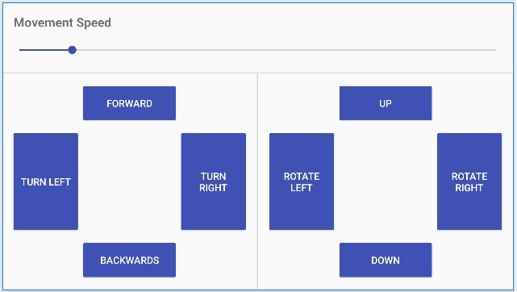

# 하단의 원본 깃 주소의 소스를 참조하여 안드로이드 앱으로 아두이노(상품명: lilygo higrow)기기 기반의 드론을 제작할 예정 입니다.
- 앱 실행 결과 미리보기(아래)

- 앱 IDE 개발환경: 안드로이드 스튜디오 2022.9 돌핀 버전(그래들빌드버전 7.3.0)
- 앱 실행환경: 안드로이드4.4.x(갤럭시 S1) 이상
- 아두이노 스케치 IED 개발환경: 아두이노 1.8.x 버전
- 하드웨어 개발환경: 아두이노 ESP32칩셋 WiFi+블루투스내장 기기(상품명: lilygo higrow) 외 기타(아래)
  예전에 작업한 장비 재활용 정보 URL: https://kimilguk.tistory.com/775

# ---------------------------------------------------
# 아래 원본 깃 주소
- https://github.com/ZapsterStudios/Arduino-Bluetooth-Drone
# Arduino-Bluetooth-Drone
Bluetooth drone created for a school project using Arduino Uno and an Android app.

## Project under construction...
The project is currently very much a work in progress.
*It is expected to be finished on the 25th of April.*

----
### Credits
**Android Bluetooth bootstrap**  
How To: Create an Android App With Android Studio to Control LED by Deyson  
http://www.instructables.com/id/Android-Bluetooth-Control-LED-Part-2/

**Icon used for app launcher**  
Quadcopter connection by NOPIXEL from the Noun Project.  
https://thenounproject.com/search/?q=quadcopter&i=506820